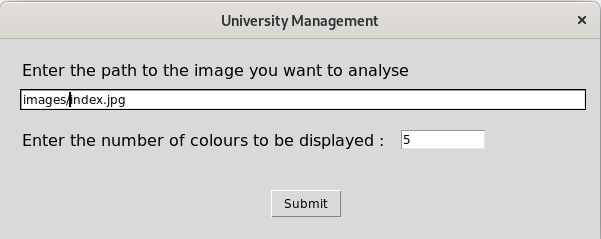
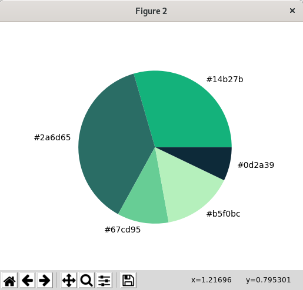
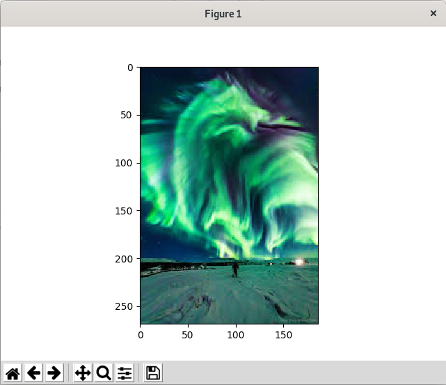

# colourDetection
A python script to detect colours present in an image and present it in the form of a pie-chart  

# Usage
  
We will be performing the operations on this image:  
  
  
let us now have a look at the simple UI:  
  
In the UI we must first enter the path of the image that we want to run the operations on and then the number of colours that you want to see on the plotted pie chart.  
  
Here is the sample pie-shart:  
  
  
Here is the sample of the image that it outputs as well :  
  
 
